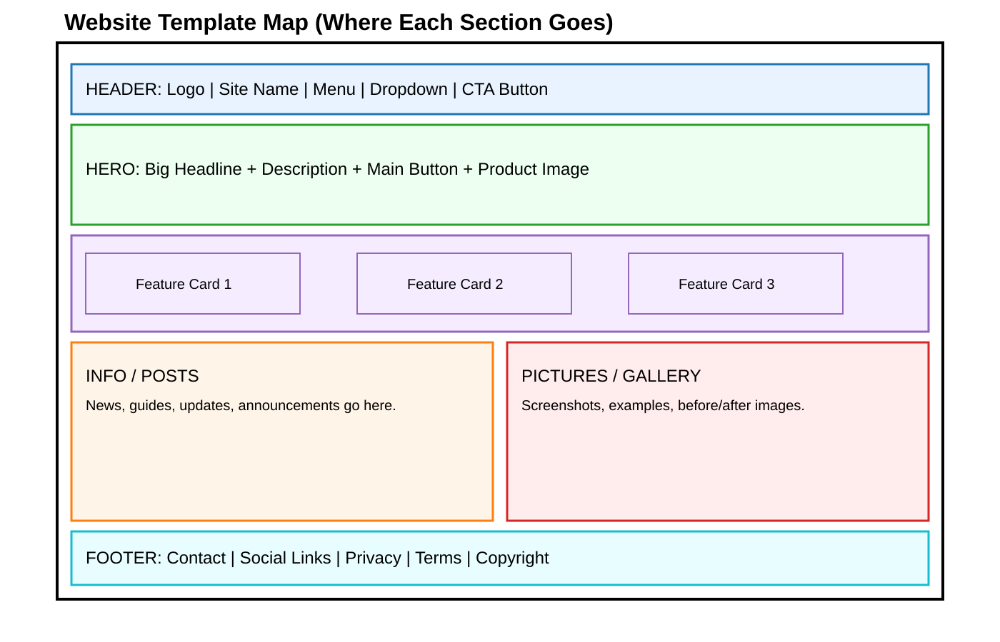

# HD + ML Tool / Website Build Guide (So Simple a 5-Year-Old Could Follow)

## 0) Super-Simple Promise
You can build a professional website/tool even from your phone by following this checklist.

Think of building a site like making a sandwich:
1. Pick your bread (template).
2. Add your ingredients (logo, text, pictures, features).
3. Press the button to publish.
4. Share your link.

If you do each tiny step, you cannot get lost.

---

## 1) Big Picture in One Minute

You need **7 building blocks**:
1. Name (what your site is called)
2. Logo (your picture mark)
3. Header (top menu)
4. Hero (main message)
5. Features area (what it can do)
6. Content area (posts, photos, updates)
7. Contact + footer (how people reach you)

---

## 2) Phone-Only Tool Stack (Easy Mode)

Use this stack if you want to build from your phone with minimum stress.

### Option A (No code, fastest)
- **Canva** (logo + graphics)
- **Notion / Framer / Wix / Squarespace** (site building)
- **Tally or Typeform** (forms)
- **Airtable / Google Sheets** (data)

### Option B (Low code with AI)
- **ChatGPT / Claude / Gemini** (generate copy + code snippets)
- **Replit / GitHub Codespaces** (edit and host from phone browser)
- **Vercel / Netlify / Cloudflare Pages** (deployment)

### Option C (Full code)
- HTML/CSS/JS or React/Next.js
- GitHub + cloud deployment

If you’re brand new, start with **Option A**.

---

## 3) “Before You Build” 10-Minute Planning Sheet

Copy this into Notes and fill it out.

### Planning Template
- **Website Name:**
- **One-line Description:**
- **Who is it for?:**
- **Main Problem it solves:**
- **Top 3 Features:**
  1.
  2.
  3.
- **Call-To-Action button text:** (example: “Try Free”)
- **Brand style words:** (example: clean, modern, fast)
- **Colors:**
- **Logo idea:**
- **First 3 pages:** Home / Features / Contact (or your choice)

---

## 4) Step-by-Step Build Walkthrough (Tiny Steps)

## Step 1: Pick a Template First
Do not start from blank. Pick one template from section 8 below.

Goal: make decisions smaller and faster.

## Step 2: Choose Website Name + Tagline
- Name should be short and easy.
- Tagline is one sentence saying what it does.

**Formula:**
`[Tool Name] helps [audience] do [result] in [time/way].`

Example:
`FlipPilot helps OSRS traders find better flips in minutes.`

## Step 3: Create a Logo (Phone-Friendly)
1. Open Canva app.
2. Search “minimal tech logo”.
3. Pick one simple icon.
4. Add your tool name.
5. Export PNG (transparent background if possible).

Files to export:
- `logo.png` (header use)
- `logo-square.png` (social profile use)

## Step 4: Build Header + Navigation
Your header should include:
- Logo (left)
- Website name
- Menu links: Home, Features, Pricing, Blog, Contact
- CTA button: “Start Free”

Keep menu to 4–6 links max.

## Step 5: Build Hero Section (Top First Screen)
Include:
- Big headline
- Simple supporting sentence
- 1 main button + optional 2nd button
- Product screenshot/mockup image

**Hero copy template:**
- Headline: `Get [big result] without [pain].`
- Subtext: `Our tool helps [audience] do [outcome] using [method].`
- Button 1: `Try Free`
- Button 2: `Watch Demo`

## Step 6: Add Features (Cards or Dropdown)
For each feature, add:
- Name
- 1 sentence benefit
- Small icon

Use 3 to 6 features.

Optional: Use a dropdown menu in header for feature categories.

## Step 7: Add Content + Pictures Section
Create two blocks:
1. **Information block** (announcements, guides, updates)
2. **Media block** (images, screenshots, before/after)

Add a “Latest Updates” section to show freshness.

## Step 8: Add Trust Signals
- Testimonials
- “As seen on” logos (if real)
- Statistics (if real)
- Security/privacy notes

## Step 9: Add Contact + Footer
Footer should include:
- Email
- Social links
- Privacy Policy
- Terms
- Copyright

## Step 10: Publish
- Connect domain name
- Click publish
- Open on phone and test all buttons

---

## 5) AI Prompt Templates You Can Reuse

Use these as plug-and-play prompts.

### Prompt: Website Copy Generator
`You are a world-class conversion copywriter. Write website copy for my tool.
Tool name: [NAME]
Audience: [AUDIENCE]
Problem solved: [PROBLEM]
Top features: [FEATURES]
Tone: simple, confident, human.
Output sections: Hero headline, Hero subheadline, 5 feature cards, CTA text, FAQ (5 questions), Footer summary.`

### Prompt: UI Layout Assistant
`Create a clean mobile-first website layout for [TOOL NAME].
Must include: logo area, header nav, hero, feature cards, dropdown for tools, information section, image gallery section, pricing cards, FAQ, contact form, footer.
Output as: section-by-section checklist + suggested spacing + color usage rules.`

### Prompt: No-Code Builder Instructions
`Give me exact click-by-click steps to build this website in [Wix/Framer/Notion].
I am using only a phone browser.
Use tiny steps with checkbox tasks.`

---

## 6) Professional Quality Checklist (Use Before Launch)

### Branding
- [ ] Logo is clear on light and dark backgrounds.
- [ ] Colors are consistent.
- [ ] Font is readable on mobile.

### UX
- [ ] Main button is visible without scrolling.
- [ ] Navigation is simple.
- [ ] Dropdown works on mobile tap.

### Content
- [ ] Headline explains value in under 8 seconds.
- [ ] Features explain benefits, not only technical words.
- [ ] Contact info is easy to find.

### Performance + Trust
- [ ] Images compressed.
- [ ] HTTPS enabled.
- [ ] Privacy and Terms pages included.

### Conversion
- [ ] At least 1 strong CTA per section.
- [ ] Form works and sends responses.
- [ ] Thank-you message appears after submit.

---

## 7) “Impossible to Fail” Build Flow (One-Page Master Checklist)

1. Fill planning sheet.
2. Pick template.
3. Make logo.
4. Write headline + subheadline.
5. Add 3–6 feature cards.
6. Add info + image sections.
7. Add contact/footer.
8. Connect domain.
9. Test on phone.
10. Publish and share.

If stuck: do not redesign. Go to the next item.

---

## 8) Ready-Made Website Templates

## Template A: SaaS Tool Site
Best for: software tools, ML tools, dashboards.

Sections:
1. Header
2. Hero
3. Features grid
4. Demo screenshot block
5. Pricing
6. FAQ
7. Contact
8. Footer

### Fill-in Template
- **Site Name:**
- **Headline:**
- **Subheadline:**
- **Primary CTA:**
- **Feature 1:**
- **Feature 2:**
- **Feature 3:**
- **Pricing plans:**
- **Support email:**

## Template B: Content + Community Site
Best for: educational projects, blogs, communities.

Sections:
1. Header
2. Hero
3. Latest posts
4. Categories dropdown
5. Featured images
6. Newsletter
7. Footer

## Template C: Portfolio + Service Site
Best for: agencies, freelancers, studios.

Sections:
1. Header
2. Hero intro
3. Services cards
4. Portfolio gallery
5. Testimonials
6. Contact form
7. Footer

## Template D: Marketplace / Listing Site
Best for: directories, item listings, catalog tools.

Sections:
1. Header + search
2. Filters dropdown
3. Listing cards
4. Item details
5. Save/favorite
6. Contact/support
7. Footer

---

## 9) Section-by-Section Mini Templates

## Logo Block Template
- Left icon image
- Tool name text
- Optional short slogan

## Header Menu Template
- Home
- Features
- Resources
- Pricing
- Contact
- CTA button

## Feature Card Template
- Icon
- Title
- One-line benefit
- “Learn more” link

## Info Post Template
- Title
- Date
- 2–5 sentence summary
- Read more button

## Picture Post Template
- Image
- Caption
- Category tag
- Optional source link

## Dropdown Menu Template
- Product Tools
  - Analyzer
  - Alerts
  - Dashboard
- Learning
  - Guides
  - Tutorials
  - FAQs

---

## 10) Safe Launch and Growth Plan

### Launch Day
- Publish and test all links.
- Ask 3 people to use your site on mobile.
- Fix only the broken/confusing parts.

### Week 1
- Add 3 real updates/posts.
- Track clicks on main CTA.
- Improve headline based on user confusion.

### Week 2+
- Add email capture.
- Add onboarding guide.
- Add user feedback form.

---

## 11) Bonus: If You Want an “HD ML Tool” Specifically

Think of ML tool pages in this order:
1. **Input** (what users upload/type)
2. **Processing** (what model does)
3. **Output** (what users get)
4. **Control** (settings/dropdowns)
5. **Save/Share** (download/export)

Minimum professional ML feature set:
- Upload/input box
- Run button
- Result panel
- History panel
- Error/help panel
- Pricing/usage panel

---

## 12) Final Reminder
You do not need perfection.
You need a clean structure + clear message + working buttons.

Build like blocks. One block at a time.

---

## 13) Visual Placement Map (Use This While Building)

Use this map to know exactly where each template section goes on the page.

